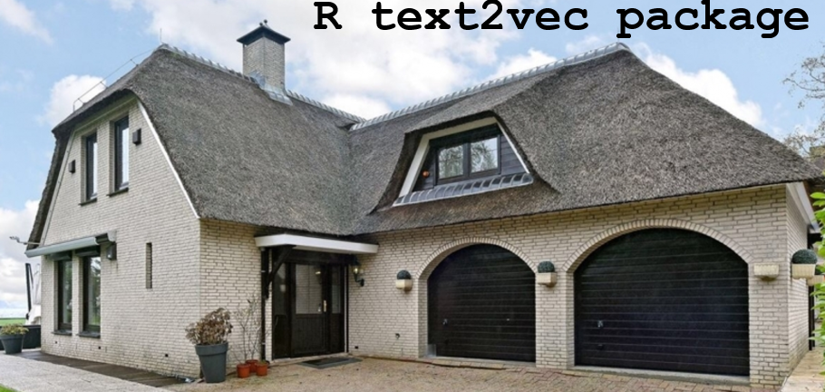

# jaap

  

R scripts to scrape jaap, and some RDs files with the results, There are RDs without 'huizenbeschrijving', and the ones with 'huizenbeschrijving'. The script Jaap_textmining.R is used to see which terms / words in the huizenbeschrijving have a big impact on the house price.

